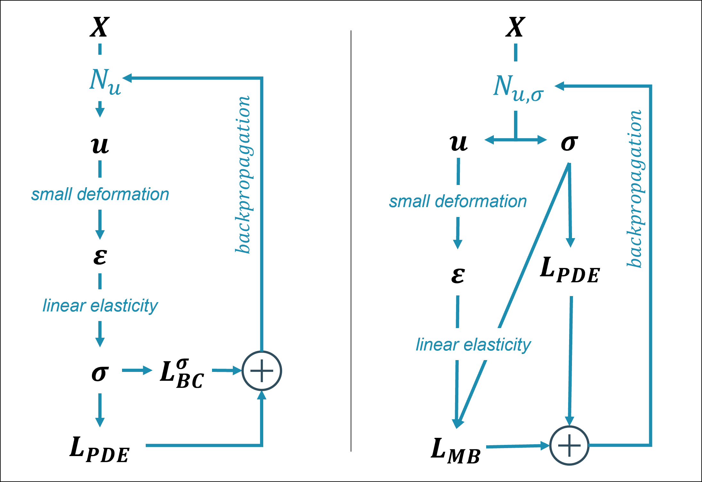

# pinn-cm

### Physics-Informed Neural Network to solve a boundary value problem
Implementation of the PINN (Physic-Informed Neural Network) framework for continuum mechanics problems.
This repository contains the code used to generate the results of the conference paper "Quantifying uncertainty of Physics-Informed Neural Networks for continuum mechanics applications".
It relies on the [DeepXDE](https://github.com/lululxvi/deepxde) library.

We address the boundary value problem introduced in [Haghighat et al.](https://arxiv.org/abs/2003.02751) that has an analytical solution (considering linear elasticity).
We consider the unit square domain: $\Omega = [0,1]^2$, on which the continuum mechanics equations applies :

$\epsilon_{ij} = \frac{1}{2}(u_{i,j}+u_{j,i}) $\
$\sigma_{ij} =  \lambda \epsilon_{ij} \delta{ij} + 2 \mu \epsilon_{ij}$\
$\sigma_{ij,j} + f_{i} = 0 $

The boundary conditions are summarized in the image below, and the body forces are chosen on purpose so that there can be an analytical solution:

$fx = \lambda \left(- \pi Q y^{3} \cos{\left(\pi x \right)} + 4 \pi^{2} \sin{\left(2 \pi y \right)} \cos{\left(2 \pi x \right)}\right) + \mu \left(- \pi Q y^{3} \cos{\left(\pi x \right)} + 9 \pi^{2} \sin{\left(\pi y \right)}\right)$\
$fy = \lambda \left(- 3 Q y^{2} \sin{\left(\pi x \right)} + 2 \pi^{2} \sin{\left(2 \pi x \right)} \cos{\left(\pi y \right)}\right) + \mu \left(\frac{\pi^{2} Q y^{4} \sin{\left(\pi x \right)}}{16} - 6 Q y^{2} \sin{\left(\pi x \right)} + 2 \pi^{2} \sin{\left(2 \pi x \right)} \cos{\left(\pi y \right)}\right)$

### Simplified BVP
A simplified version of the problem is first considered, with only Dirichlet boundary conditions. 
The PINN converges to the analytical solution, with a final error of about 1e-5 (see results/simplified_BVP/).
This proves that the neural network has enough capacity to learn the solution.

### Mixed BVP
The mixed boundary value problem is then considered, with both Dirichlet and Neumann boundary conditions.
Two implementations are considered (as illustrated in the image below): 
- direct implementation (left), where displacement is predicted by the PINN and stress is then computed using the constitutive law
- parallel implementation (right), where the PINN predicts both displacement and stress, the constitutive law is enforced "softly" using an extra loss term

The convergence is not as good as in the simplified problem, with a final error of about 5e-3 (see results/mixed_BVP/).

### Hyperparameter optimization
To improve the accuracy, we perform hyperparameter optimization using Weights & Biases (wandb.com). The results are available in this [W&B report](https://api.wandb.ai/links/damien-bonnet/2ok0l39j)
The minimum error reached is about 3e-3, which is a small improvement, but still far from the accuracy of the simplified problem.
The model seems stuck in a local minimum due to the mixed boundary conditions (the model is capable enough to learn the solution, as shown in the simplified problem).
This encourages further investigation of better ways to implement the mixed boundary conditions in the PINN framework.

## Structure
    pinn-cm/
    ├── figures/ # figures used in the README and the notebooks
    ├── HPO/ # hyperparameter optimization
    │   ├── HPO.ipynb # hyperparameter optimization for the mixed BVP
    │   ├── mixed_BVP.py # mixed BVP functions (identical to the ones in the notebook)
    │   └── wandb/ # runs stored using Weights & Biases
    ├── inverse identification/ # inverse identification of the material parameters
    │   └── linear_elasticity.ipynb
    ├── results/ # results of the notebooks
    │   ├── mixed_BVP 
    │   └── simplified_BVP 
    ├── analytical_solution.ipynb # analytical solution of the problem using Sympy (symbolic math)
    ├── mixed_BVP.ipynb # mixed boundary value problem
    └── simplified_BVP.ipynb # simplified boundary value problem (only Dirichlet BCs)

## Author
Damien Bonnet-Eymard
